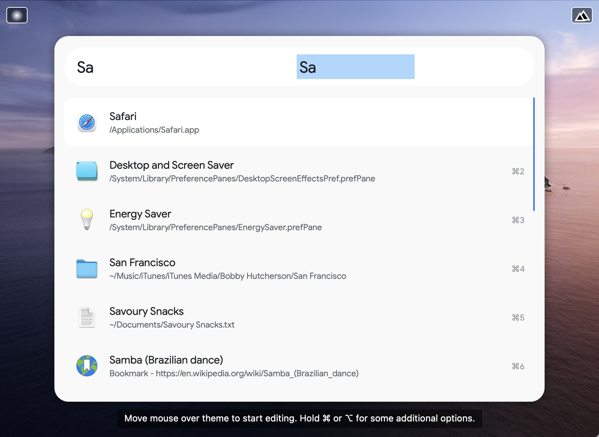

# Google Powerpack Theme

Here is an [Alfred Powerpack Theme](https://www.alfredapp.com/help/appearance/) that is inspired by Google's iOS Widgets's appearance and color scheme.

<a href="https://github.com/chrismessina/alfred-theme-google/raw/main/alfred-theme-google.zip" class="button">
  <bigger>Download Theme</bigger>
</a>

## Installation

This theme uses [Google Sans](https://www.typewolf.com/google-sans), which is [available for download](https://www.cufonfonts.com/font/google-sans) from Cufon Fonts. Download and install that first.

Then download and unzip the file above, and double-click each `.alfredappearance` file to install it.

## Previews

### Google (Light)

### Google (Dark)

## Suggested configuration

- Disable the Alfred hat logo by unchecking: `Alfred Preferences › Appearance › Options › Hide hat on Alfred window`
- Disable result shortcuts by unchecking: : `Alfred Preferences › Appearance › Options › Hide result shortcuts`

Simplify results by switching the result subtext to "Only for Alternative Actions".

## Inspiration

The inspiration for this theme are Google's iOS Widgets:

## About

This theme is unaffiliated with nor endorsed by Google, Inc.

<a href="https://www.alfredforum.com/topic/16270-google-inspired-theme/">Alfred Forum link</a>.
